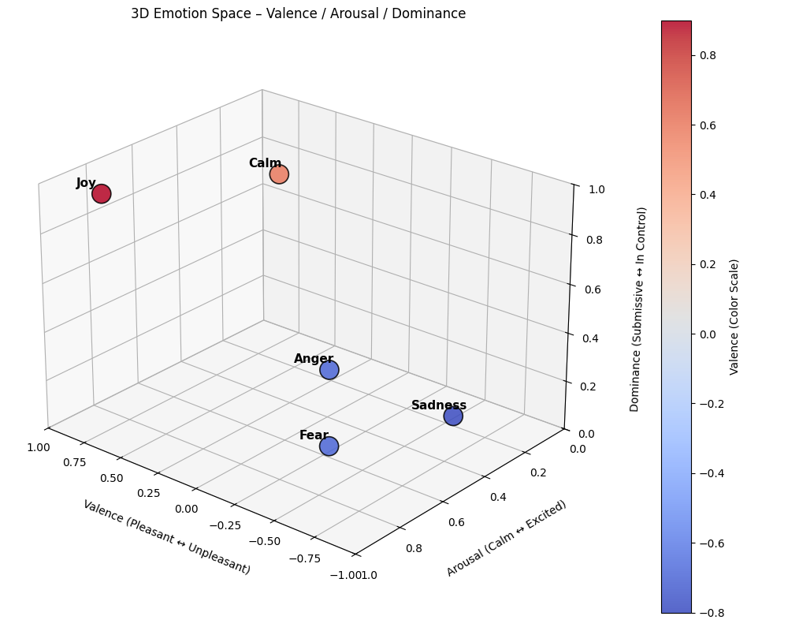

# Objective

The objective of this project is to design and prototype a **VAD (Valence–Arousal–Dominance)-driven AI chatbot** capable of detecting emotional tone in text and adapting its responses accordingly. The system aims to model *empathy at scale* -- enabling AI to respond more naturally, reduce frustration, and improve user trust and satisfaction in customer interactions.

Unlike most chatbots that focus purely on semantic accuracy, this project introduces an **emotional dimension** to communication. By quantifying emotion along three measurable axes -- valence (positivity), arousal (intensity), and dominance (control) -- the AI can dynamically adjust tone, phrasing, and pacing to match the user's mood.

The first application focus is **customer service**, where tone and empathy have measurable business impact:

- **Faster conflict resolution**
- **Higher customer satisfaction**
- **Reduced escalation to human agents**

This study represents **Phase 1** of a broader initiative to integrate emotion-aware intelligence into conversational systems, paving the way for emotionally contextual AI experiences across industries.

---

# Business Justification

Customer service interactions are one of the most emotion-sensitive touchpoints for any business. Research consistently shows that:

- 68% of customers leave after feeling “unheard” or “mistreated.”
- Empathetic tone alone can increase resolution satisfaction by 20–30%.
- Emotionally aware automation can reduce human escalations by up to 50%.

Despite these stakes, **most AI support systems lack affective awareness** -- they detect what was said, not how it was said. This leads to robotic replies that often *escalate frustration instead of diffusing it.*

An **emotionally adaptive chatbot** could transform these interactions by:

- Detecting low-valence, high-arousal messages (signs of anger or stress).
- Shifting language toward calm, empathetic phrasing.
- Reinforcing positive emotions when valence is high (e.g., celebratory tones for success).

**Business Impact Summary:**

| Area | Before VAD Integration | After VAD Integration |
|------|------------------------|-----------------------|
| Customer satisfaction | Flat or declining | ↑ Significantly (more empathy) |
| Escalation rate | High | ↓ 30–50% |
| Brand perception | “Automated and cold” | “Human, emotionally intelligent” |
| Agent load | Reactive | Proactively managed via emotion detection |

This project’s goal is not only technical but *transformational* -- to make AI a **brand ambassador of empathy**, not just efficiency.

---

# Data Acquisition Plan

The success of a VAD-driven chatbot relies on the quality and emotional diversity of its data.  
This project will develop its dataset through a **hybrid acquisition approach**, combining **real-world data**, **synthetic augmentation**, and **manual labeling**.

## Data Source Candidates

| Source | Description | Emotion Value |
|--------|--------------|----------------|
| **Customer Service Chat Logs (anonymized)** | Real-world transcripts showing frustration, satisfaction, or confusion | High realism for tone detection |
| **Minecraft Server Chat Logs** | Organic, expressive text — ideal for modeling emotional intensity and humor | Great for training contextual VAD detection |
| **Open Datasets (GoEmotions, EmoBank)** | Public emotion-labeled corpora with VAD mappings | Foundation for baseline modeling |
| **Synthetic Data** | Generated conversational snippets to fill emotional “gaps” | Balanced representation across emotion ranges |

## Labeling Strategy

Each chat message or utterance will be annotated along the **Valence–Arousal–Dominance** scale:

| Dimension | Scale | Description |
|------------|--------|-------------|
| **Valence** | −1.0 → +1.0 | Positive vs. negative feeling |
| **Arousal** | 0.0 → 1.0 | Calm vs. intense energy |
| **Dominance** | 0.0 → 1.0 | Powerless vs. confident control |

A semi-manual process will be used:

1. Human labeling of seed data (for calibration and interpretability).  
2. Model-assisted VAD prediction using pretrained emotion lexicons.  
3. Cross-validation and normalization to maintain consistency.

Example schema:

| timestamp | user_input | valence | arousal | dominance |
|------------|-------------|----------|----------|------------|
| 2025-10-12 18:21:10 | "I’ve already tried that three times!" | −0.7 | 0.9 | 0.4 |
| 2025-10-12 18:22:05 | "That worked perfectly, thanks!" | +0.9 | 0.7 | 0.8 |

---

# Feature Engineering and Conceptual Model

## Emotional Space Visualization

Below is an example 3D visualization of the Valence–Arousal–Dominance (VAD) space used to model emotional tone within our chatbot.

{width=70% .center}

## Engineered Emotional Features

| Feature Name | Description |
|---------------|-------------|
| `emotional_shift` | Measures the change in valence between consecutive messages to detect mood recovery or escalation. |
| `engagement_intensity` | Weighted blend of arousal and dominance — measures emotional activation. |
| `response_alignment` | Quantifies how closely the bot’s tone mirrors the user’s VAD state (empathy consistency). |

These features form the foundation for an **adaptive response layer**, which governs how the chatbot replies based on emotional input.

## Prototype Model Flow

1. **Input Layer:** User sends a message.  
2. **VAD Classifier:** Predicts valence, arousal, dominance.  
3. **Emotion Policy Engine:** Chooses appropriate tone (empathetic, neutral, excited, etc.).  
4. **Response Generator:** Produces a reply that matches both semantic and emotional context.  
5. **Feedback Loop:** Monitors next message VAD to measure emotional improvement.

```text
User Message → VAD Inference → Emotion Policy → Adaptive Response → Feedback & Memory
```

---

# Implementation Roadmap (Phase 1)

| Phase | Description | Deliverable |
|--------|--------------|--------------|
| **1. Data Acquisition & Labeling** | Gather chat logs, preprocess, and annotate VAD values. | Initial labeled dataset |
| **2. Exploratory Analysis** | Visualize emotional distributions and clusters. | VAD 3D scatter and heatmaps |
| **3. Prototype Model Development** | Fine-tune transformer model (text → VAD regression). | Baseline emotion detection model |
| **4. Empathy Policy Layer** | Develop rule-based tone adaptation logic. | Adaptive chatbot module |
| **5. Evaluation & Metrics** | Test emotional accuracy and satisfaction lift. | Empathy effectiveness report |

Each phase will produce tangible outputs suitable for publication and iteration in future blog posts.

---

# Expected Outcomes

This project aims to produce a **working emotional intelligence layer** for conversational AI that can:

- Detect user frustration early (low valence, high arousal).
- De-escalate conflict via empathetic tone.
- Sustain positive engagement over long interactions.
- Adapt communication style per emotional context.

The anticipated result is a **chatbot that feels more human**, both linguistically and psychologically.  
Beyond customer service, this framework could later expand into healthcare, education, and personal productivity systems -- anywhere empathy and tone influence human experience.

---

# Next Steps and Future Posts

Future blog posts in this series will document:

1. **Data Collection and Labeling Results** — including real examples from chat data.  
2. **VAD Distribution Visuals and Feature Insights.**  
3. **Model Architecture Deep Dive** — including code snippets and evaluation metrics.  
4. **Empathy Layer Demonstration** — with real-time emotional adaptation in simulated conversations.  

The final milestone will showcase an **interactive demo** where users can experience the chatbot’s emotional adaptability firsthand.

---

# Supporting Assets (Planned)

- **Notebook 1:** Data extraction and preprocessing pipeline  
- **Notebook 2:** VAD labeling and feature visualization  
- **Notebook 3:** Model prototyping and policy testing  
- **Notebook 4:** Business impact simulation and presentation visuals  

These assets will be included in future posts to ensure transparency and reproducibility as the project evolves.

---

*This proposal marks the foundation for building emotionally aware, data-driven AI systems -- capable of understanding not only language but human experience itself.*
