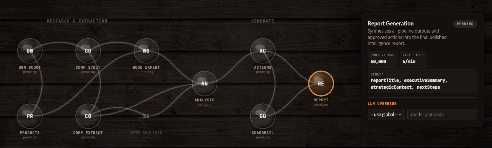
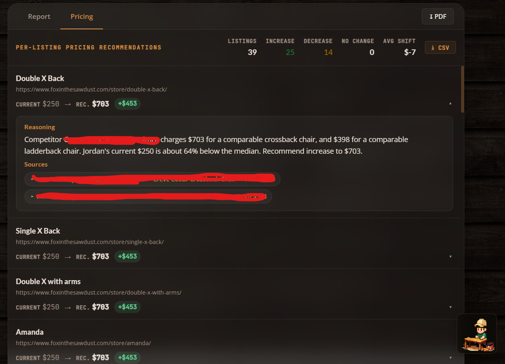
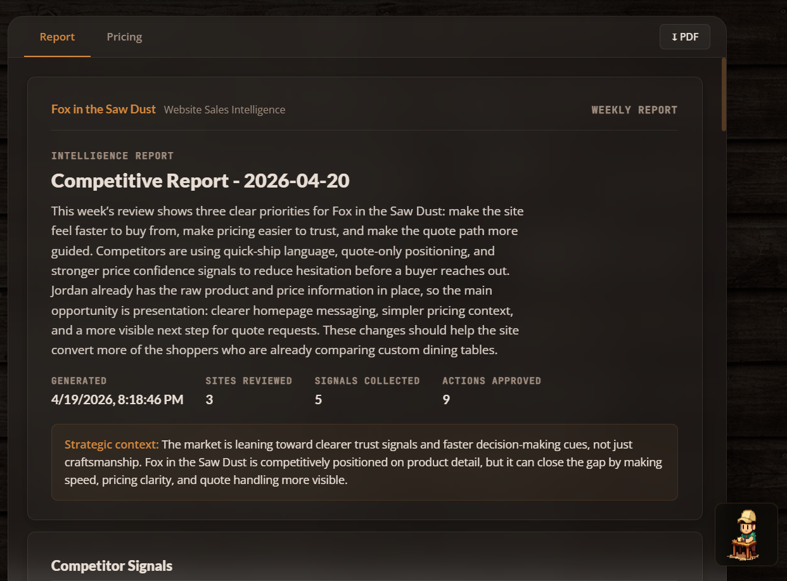
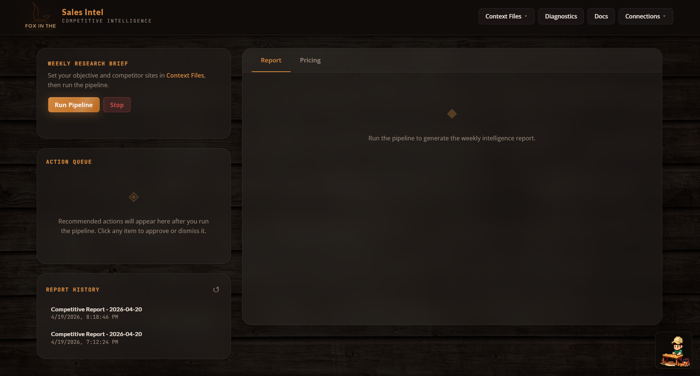

# The Problem

The owner of **Fox in the Sawdust** is a skilled craftsman who already knows his market well. He's built a reputation on quality, understands his materials, and prices his work with confidence earned through years of experience. But he also recognized something that most small business owners don't: the competitive landscape moves faster than any one person can track manually.

Larger regional competitors have dedicated marketing teams and pricing analysts monitoring the market full-time. For a one-person operation, spending three hours a week browsing competitor sites isn't just tedious. It's time taken away from the craft and the customers.

He came to me with a clear vision: he wanted an AI-powered system that could do that research automatically, on demand, and deliver results he could actually act on. He understood that agentic AI isn't a gimmick. It's the kind of tool that lets a small business operate with the intelligence of a much larger one. That kind of forward thinking is exactly what made this project possible.

# The Approach

I built a fully autonomous multi-agent intelligence pipeline for Fox in the Sawdust. In plain English: you click one button, and a team of AI agents goes out, collects competitor data, analyzes it, builds a strategy, validates it, and hands you a polished report, all in about two minutes.

Instead of one giant prompt doing everything (which would be messy and unreliable), the system breaks the work into a **10-agent pipeline**. Each agent has one clear job, and they pass their output to the next agent in line, like an assembly line built for intelligence.

Here's the bird's-eye view:

| Stage | Agent(s) | What It Does |
|-------|----------|--------------|
| Collection | `own_scout`, `comp_scout` | Crawls the owner's site and competitor sites for raw content |
| Extraction | `own_extractor`, `extractor`, `wood_expert` | Pulls out product listings, pricing, materials, and woodworking details |
| Analysis | `site_analysis`, `analyst` | Evaluates site structure, tone, and competitive positioning |
| Strategy | `recommender` | Generates prioritized, actionable recommendations |
| Validation | `guardrail` | Flags any made-up claims and checks pricing math |
| Output | `report_gen` | Compiles everything into a structured intelligence report |

Each agent has its own system prompt, context budget, output format, and rate limit. Where agents don't depend on each other, they run in parallel. A sliding-window rate limiter and per-agent context caps keep API costs predictable and prevent token blowout.

# Meet the Agents

## 1. Own Scout

**Model:** gpt-4o-mini · **Context Cap:** 50K · **LLM Calls:** None

This is the one agent in the entire pipeline that makes zero LLM calls. It's a pure fetch-and-discover agent that visits the client's homepage and known category pages (`/dining-tables/`, `/dining-chairs/`, `/custom-projects/`), then uses regex to find product URLs under `/store/`.

Why no LLM? Because your own website doesn't need interpretation. It just needs scraping. Spending tokens to "understand" pages you already control is waste. Fetch-and-regex is faster, cheaper, and completely deterministic. This agent just does the legwork so the next one can do the thinking.

## 2. Own Extractor

**Model:** gpt-5.4-mini · **Context Cap:** 50K · **LLM Calls:** 1

The own extractor takes all that raw page content from the scout and pulls out every unique product listing with its price. Its instructions are deliberately narrow: *"You are a product listing extractor. Read website content and extract every unique product with its price. Respond with valid JSON only."*

It deduplicates, skips low-value items like accessories and hardware, and outputs a clean list of products and prices. If the LLM call fails for some reason, this agent has a regex-based fallback. No other agent in the pipeline needs one, because the client's own listings are the one dataset predictable enough for regex to handle.

This list becomes the foundation for everything pricing-related downstream.

## 3. Competitor Scout

**Model:** gpt-4o-mini · **Context Cap:** 50K · **LLM Calls:** 3

This is the most complex agent in the pipeline, and honestly, it's one of the most fun to watch work. The competitor scout doesn't just fetch a homepage and hope for the best. It **navigates** competitor sites using a three-phase crawl:

1. **Phase 1: Homepage fetch.** Grabs the competitor's root page and extracts all internal links.
2. **Phase 2: Link picker.** An LLM call reviews the discovered URLs and picks up to 8 category or listing pages most likely to contain product links.
3. **Phase 3: Product page picker.** A second LLM call selects up to 12 individual product detail pages, specifically the ones most likely to have actual dollar amounts.

After all three phases, a third LLM call performs the main competitive analysis. Every signal follows a strict format: *"[Competitor domain] [what they do] [why that matters for Fox in the Sawdust]"*. And the agent is explicitly told: never fabricate pricing data. If a competitor hides their prices, that itself becomes a signal.

The three-call architecture costs more per competitor, but it means the agent actually *finds* product pages instead of guessing from homepage copy. On a typical run with 3 competitors, this agent accounts for ~9 LLM calls, the most of any single agent.

## 4. Extractor

**Model:** gpt-5.4-mini · **Context Cap:** 2M · **LLM Calls:** 1

The extractor takes the free-text observations from the competitor scout and normalizes them into a structured comparison format. Where the scout produces narrative observations, the extractor produces rows in a table: competitor name, offer focus, pricing visibility (Low/Medium/High), trust signals, messaging shifts, and data source type.

Its context cap is 2M, the largest in the pipeline, because it receives the full raw crawl data, which can be substantial when competitors have rich product pages.

This normalization step is what makes everything downstream possible. The analyst and recommender don't have to parse free text. They work with clean, structured competitor profiles.

## 5. Wood Expert

**Model:** gpt-5.4-mini · **Context Cap:** 2M · **LLM Calls:** 1

This is the domain expert, and honestly, this is the agent that makes the whole system actually *smart* instead of just fast.

The wood expert knows the difference between white oak and red oak, understands why a mortise-and-tenon joint costs more than a pocket-screw joint, and can tell whether two tables from different makers are actually comparable.

It takes the client's product catalog and the competitor listings, then identifies **comparable products**, specifically items that share the same category and similar characteristics. The output includes a similarity score (minimum 0.5), a match reason, and a category. This feeds directly into the pricing engine.

Without this agent, the system would be comparing a high-end custom dining table to an entry-level mass-produced piece and calling it a pricing insight. Not helpful.

## 6. Site Analysis

**Model:** Global default · **Context Cap:** 50K · **LLM Calls:** 1

The site analysis agent turns the lens inward. Given the client's own website content and the structured competitor data, it performs a SWOT-style evaluation: strengths, weaknesses, opportunities, and a summary.

Its prompt includes a line that matters a lot: *"Be specific and honest. This analysis drives the recommendations."*

Early versions of this agent produced generic fluff like "improve your SEO." The current version is grounded: if a competitor surfaces a key element prominently on their homepage while the client's equivalent is buried deeper in the navigation, that kind of specific, comparative observation is what makes the downstream recommendations actionable.

## 7. Analyst

**Model:** gpt-5.4-mini · **Context Cap:** 2M · **LLM Calls:** 1

The analyst is the strategic brain of the pipeline. It cross-references the structured competitor data with the internal site analysis and produces exactly **5 insights**, each with a theme, evidence, impact assessment, priority, and source URL.

Here's the key constraint: *"Every insight tells the client what THEIR site does, what competitors do differently, and what they should do about it. Never describe a competitor without also describing what the client currently does."*

This comparative framing was a deliberate choice. Early versions would say things like "a regional competitor has strong trust messaging." Interesting, but not useful. The current version says something like: "The client's site lacks a visible craftsmanship guarantee. Competitor A has one above the fold. Adding a similar block would address this gap." Same data, completely different utility.

Priorities must also be distributed. The agent can't mark everything as High, which prevents the action queue from becoming a wall of equal-urgency items.

## 8. Recommender

**Model:** gpt-5.4-mini · **Context Cap:** 2M · **LLM Calls:** 1

The recommender turns insights into specific, approval-ready actions. It takes the analyst's insights, the competitor data, and the original context, then produces exactly **9 actions**: 3 UX improvements, 3 pricing recommendations, and 3 quoting workflow changes.

Every recommendation must start with hedged language: *"Suggest testing:"*, *"Consider adding:"*, or *"Review whether:"*. This isn't about being wishy-washy. It's a design choice. The business owner approves actions; the system suggests them.

Pricing recommendations have to reference actual dollar figures. So instead of "raise your prices," you get something like: *"Suggest testing: raising Product X from its current price to a higher tier, since comparable items from a regional competitor start significantly above that."* Grounded in real data, not abstract percentages.

Each action includes impact level, effort estimate, owner, category, rationale, and a source URL, all surfaced as approvable cards in the dashboard.



## 9. Guardrail

**Model:** gpt-5.4-mini · **Context Cap:** 2M · **LLM Calls:** 1

The guardrail is the final check before the report gets generated. It receives the full output from every preceding agent and looks for problems.

**First pass: regex-based.** Four patterns catch the most common LLM overstatements:

- Percentage guarantees (*"guaranteed 30% increase"*)
- Certainty claims (*"will definitely improve"*)
- Absolute claims (*"always works"*)
- Unverified proof claims (*"proven to double"*)

If any action text matches these, it's flagged before the LLM even sees it.

**Second pass: LLM review.** The full policy check: JSON format intact, context budgets respected, recommendations framed as suggestions, no unsourced pricing claims, and human approval required for all actions.

The output is binary: `"passed"` or `"review-needed"`. If anything gets flagged, the report includes exactly what was caught and why. The business owner sees it all.

## 10. Report Generator

**Model:** gpt-5.4-mini · **Context Cap:** 50K · **LLM Calls:** 1

The final agent pulls everything together: approved actions, strategic insights, site analysis, competitor overview, and guardrail status. It synthesizes them into a polished weekly intelligence report.

Its prompt: *"You are a senior strategist writing a polished weekly competitive intelligence report for a small business owner. The report should be clear, direct, and immediately useful. No filler."*

The output includes a report title, executive summary, strategic context, and the top 3 priority next steps. In the dashboard, this renders as a multi-page document with a cover, sections, insight cards, action rows, and guardrail status, all styled in the dark woodshop theme.

The context cap here is intentionally lower (50K vs. 2M for the analysts) because the report agent should be working with already-distilled insights, not re-processing raw data.



# Pipeline Architecture

Here's how the data flows:

```
own_scout → own_extractor → comp_scout → extractor ──┬── site_analysis → analyst → recommender → guardrail → report_gen
                                                      └── wood_expert ──┘
```

Most of the pipeline is sequential, with each agent's output feeding the next. The one exception: `extractor` and `wood_expert` run in parallel, since they both depend on the competitor scout's output but don't depend on each other.

Every agent call is wrapped by the `executeAgent` runner, which handles:

1. **Rate limiting:** per-agent, 60-second sliding window
2. **Context cap enforcement:** serializes the payload and checks against the agent's limit
3. **Execution:** runs the agent's function
4. **Validation:** checks the output against the agent's declared schema
5. **Metadata:** returns context usage stats, truncation info, and schema compliance

Here's the full agent lineup:

| Agent | Model | Context Cap | Rate Limit |
|-------|-------|-------------|------------|
| `own_scout` | gpt-4o-mini | 50K | 12/min |
| `own_extractor` | gpt-5.4-mini | 50K | 20/min |
| `comp_scout` | gpt-4o-mini | 50K | 12/min |
| `extractor` | gpt-5.4-mini | 2M | 20/min |
| `wood_expert` | gpt-5.4-mini | 2M | 12/min |
| `site_analysis` | global default | 50K | 10/min |
| `analyst` | gpt-5.4-mini | 2M | 10/min |
| `recommender` | gpt-5.4-mini | 2M | 8/min |
| `guardrail` | gpt-5.4-mini | 2M | 30/min |
| `report_gen` | gpt-5.4-mini | 50K | 6/min |

The scouts use the smaller `gpt-4o-mini`, which is perfect for page discovery and link picking where deep reasoning isn't needed. Everything from extraction onward uses the more capable `gpt-5.4-mini` for the analytical heavy lifting.

# The Interface

The dashboard is a single-page vanilla JS application. No React, no Vue, no framework at all. And that's on purpose.

The priorities were:

- **Zero build step.** Edit, save, refresh. The Node server auto-serves static files.
- **Full visibility into agent execution.** A brain-network visualization renders all 10 agents as 3D sphere nodes with SVG radial gradients, live status coloring (pending → active → complete/capped/error), and animated edge connections showing data flow. It's genuinely cool to watch.
- **Actionable output, not just reports.** An Action Queue surfaces each recommendation as an approvable/dismissable card with impact and effort tags. The owner can edit recommendations before applying them.
- **Pricing dashboard.** Per-product cards showing current vs. recommended pricing, percentage diffs, source citations, and expandable rationale.

The whole UI runs a dark woodshop theme: deep `#0e0b09` background, amber `#d4883e` accents, glassmorphism panels with blurred backdrops, JetBrains Mono for data, Lato for headings. Everything lives in a single `<style>` block for zero-dependency deployment.



# Key Design Decisions

**No framework, on purpose.** The entire client is ~4,000 lines in one `app.js`. For a tool with one user and one purpose, React or Vue would add complexity without adding value. DOM manipulation is direct and predictable.

**Context caps per agent, not globally.** Each agent has a tuned context cap. Truncation happens inside each agent's `run()` function, so every agent controls what it keeps and what it drops.

**Guardrail as a pipeline stage, not a wrapper.** Instead of filtering recommendations after the fact, the guardrail agent receives the full recommendation set and validates pricing math, source attribution, and factual claims *before* the report gets generated. It's a first-class citizen in the pipeline.

**Three-phase competitor crawling.** Rather than dumping a homepage into an LLM and asking "what do you see?", the comp_scout navigates intelligently: discover links, pick category pages, pick product pages, then analyze. This dramatically improves the quality of pricing data captured.

**A domain expert in the loop.** The wood expert exists because generic LLMs don't know that a white oak trestle table and a red oak farmhouse table aren't comparable products. Injecting domain expertise at the extraction layer prevents bad comparisons from polluting the entire pipeline.

**SVG over Canvas for the network visualization.** CSS-styleable, inspectable, and animatable without a rendering loop. Radial gradients fake 3D sphere lighting, and shadow/specular-highlight ellipses sell the depth.

# Results

- **Weekly research time:** From ~3 hours of manual browsing → one button click and a 2-minute pipeline run
- **Pricing confidence:** Recommendations grounded in actual competitor URLs and comparable product matching, not intuition
- **Action conversion:** The approve/dismiss/edit queue format turned a passive report into an active workflow
- **Deployment:** Single `node server.js` on any machine. No Docker, no cloud dependency, no build pipeline
- **Cost per run:** ~15 LLM calls across 10 agents. Scouts use the cheaper model, heavy analysis uses the capable one, and context caps prevent runaway token usage

# What I'd Do Differently

Nothing is ever truly done, and this project is no exception. Here's what's on my mind for the next iteration:

- **Add a summarization pass before report generation.** Right now the report agent receives the full data payload. A dedicated summarization step would cut token cost and improve coherence on big runs.
- **Build incremental diffing.** The system re-crawls everything each run. A diff layer that highlights *what changed* since last week would dramatically increase signal quality.
- **Add persistent action tracking.** Applied actions currently have no memory. Tying them back into the next run's context ("you already added a trust block last week") would prevent redundant recommendations.
- **Parallelize the scouts.** The own scout and comp scout could run simultaneously since they don't depend on each other. Currently sequential because the pipeline was built incrementally, but parallelizing them would shave ~30 seconds off total run time.

---

*Built as a solo internal tool for a real business with a real owner who saw where the industry is heading. Agentic AI isn't about replacing human judgment. It's about giving smart operators the intelligence layer they've always deserved. The owner of Fox in the Sawdust didn't need to be sold on the concept. He understood immediately that a system like this would let him compete on information, not just craftsmanship. That's the kind of client who makes great tools possible.*
