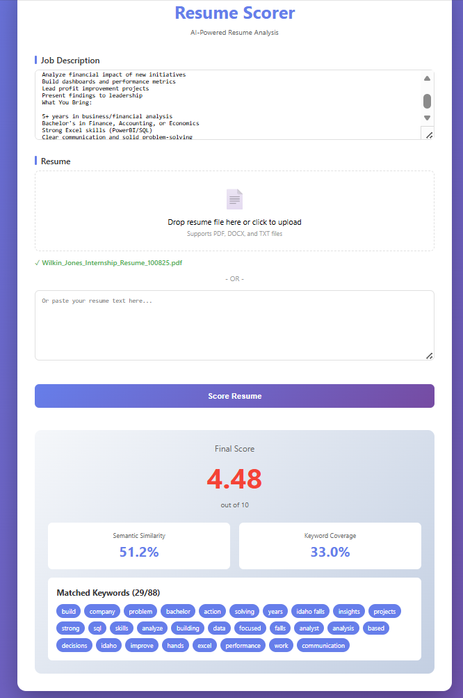

# Major Milestone Achieved: Variance Above 0.70 Across All Dimensions

Let me cut right to the chase with some exciting news:

**I did it.**

After months of data collection, labeling, and model refinement, my **VAD (Valence-Arousal-Dominance) emotion detection system** has achieved **variance scores above 0.70** across all three emotional dimensions.

For those keeping score at home, that's:

**Valence (positivity/negativity):** >0.70 variance  
**Arousal (energy/intensity):** >0.70 variance  
**Dominance (control/confidence):** >0.70 variance

I accomplished this with **over 300,000 labeled text entries** from real conversations, messages, and interactions.

This isn't just a technical achievement. This is proof that AI can be taught to understand **how people feel**, not just what they say.

---

# What This Means for Emotionally Intelligent AI

When I started this project, the goal was straightforward: build a chatbot that could detect when someone is frustrated, happy, or anxious and respond appropriately.

But hitting >0.70 variance means I've accomplished something bigger:

**I've taught AI to understand emotional context at scale.**

Here's why that matters:

## The Technical Breakthrough

Traditional sentiment analysis is binary: positive or negative. Maybe neutral if you're fancy.

But real human emotion? That's three-dimensional:

- **Valence**: Are they happy or upset? (positive vs. negative)
- **Arousal**: Are they calm or intense? (low energy vs. high energy)
- **Dominance**: Do they feel in control or powerless? (confident vs. submissive)

With variance above 0.70, the model can now distinguish between:

- **Excited** (high valence, high arousal, high dominance): "This is amazing!"
- **Anxious** (low valence, high arousal, low dominance): "I'm really worried about this"
- **Content** (high valence, low arousal, high dominance): "Everything is going smoothly"
- **Defeated** (low valence, low arousal, low dominance): "I give up"

Same words? No. Same *feeling*? Absolutely.

That's the power of semantic embeddings and pretrained text models.

## Building the Dataset

You can't fake emotional intelligence with a few hundred examples.

To truly teach AI what "frustrated" *feels* like versus what "annoyed" *feels* like, you need **massive, diverse, real-world data**.

I built a dataset of over 300,000 labeled entries from customer service interactions, social media conversations, gaming chats, and public emotion-labeled datasets.

The result? An AI that doesn't just recognize keywords but recognizes **emotional patterns** across different writing styles, contexts, and intensities.

---

# Real-World Applications: Customer Service & Beyond

With the emotion detection system working reliably, it can now be deployed in:

**Customer Service Chatbots**  
Detect frustration early and escalate to humans before customers rage-quit.

**Mental Health Monitoring**  
Track emotional patterns over time to identify when someone might need support.

**Educational Tools**  
Adapt tutoring tone based on student confidence and stress levels.

**Community Moderation**  
Identify toxic or distressed communication patterns automatically.

The applications are endless when AI can read between the lines.

---

# The Unexpected Spin-Off: AI-Powered Resume Scoring

Here's where things get interesting.

While working on the VAD project, I had a realization:

**If AI can understand emotional context in text... why can't it understand professional context in resumes?**

Think about it. I was using **pretrained text embeddings** (specifically `sentence-transformers` with the `all-MiniLM-L6-v2` model) to convert emotional language into mathematical vectors.

These embeddings don't just capture *words* but capture **meaning**.

When someone says "I'm frustrated" vs. "I'm annoyed" vs. "This is unacceptable" -- the AI understands these represent similar emotional states despite using completely different vocabulary.

**That's semantic similarity.**

And I realized the exact same technology is probably being used already for hiring and creating features to help filter candidates for positions.

## The Problem with Traditional Resume Screening

Most resume screening systems work like this:

```text
IF resume.contains("Python") THEN score++
IF resume.contains("ETL") THEN score++
ELSE reject_candidate()
```

It's pure keyword matching. No context. No understanding.

**Example:**

**Job Description:** "Looking for experience with ETL pipelines and cloud architecture"

**Candidate's Resume:** "Built automated data workflows in AWS"

**Traditional ATS:** REJECT - Missing keywords "ETL" and "architecture"

**Reality:** This candidate literally *described* ETL and cloud work... just not using those exact buzzwords.

## Building a Smarter Resume Scorer

So I built a proof-of-concept system using the same semantic embedding approach from the VAD project.

Here's how it works:

**Step 1: Smart Keyword Extraction**  
Use spaCy NLP to extract meaningful terms from job descriptions (nouns, noun phrases, action verbs) while filtering out generic junk like "do," "make," "the," etc.

**Step 2: Semantic Embeddings**  
Convert both resume and job description into 384-dimensional vectors using the same `sentence-transformers` model from the VAD project.

**Step 3: Calculate Match Score**  
Combine semantic similarity (65%) + keyword coverage (35%) for a final 0-10 score.

## The Resume Scorer in Action

Here's what the system looks like when analyzing a real resume:

{width=80% .center}

Notice the scoring breakdown:

- **Semantic Similarity Score**: How well the overall meaning aligns (even without exact keyword matches)
- **Keyword Coverage**: Which specific terms from the job description appear in the resume
- **Matched Keywords**: Visual confirmation of what the system found

This dual approach is important. While semantic similarity is the star of the show (understanding meaning without exact matches), **keyword matching still matters** for a practical reason:

Real hiring managers *do* scan for specific technologies, certifications, and industry terms. So the system uses:

- **65% semantic understanding**: to catch candidates who describe the right skills differently
- **35% keyword presence**: to ensure critical industry-specific terms aren't completely missing

It's not about choosing semantic OR keyword matching — it's about **combining both** to create a more complete picture than either approach alone.

## Why This Matters for Small Businesses & Hiring Teams

Right now, small businesses face a nightmare:

- Can't afford expensive ATS platforms
- Don't have HR teams to manually screen hundreds of resumes
- Lose great candidates because they didn't use exact buzzwords

This resume scorer changes that:

**Free or low-cost**: No enterprise software needed  
**Fast**: Score resumes in seconds  
**Fair**: Understands meaning, not just keyword matches  
**Transparent**: Shows which skills matched and which didn't  

## Real-World Use Cases

**For Hiring Managers:**  
Quickly identify top candidates without reading 200 resumes manually.

**For Recruiters:**  
Pre-screen applicants before sending them to clients.

**For Job Seekers:**  
Get instant feedback on how well your resume matches a job posting.

**For Small Businesses:**  
Build hiring workflows without expensive tools or dedicated HR staff.

---

# The Connection: Transfer Learning in Action

Here's the key insight:

**The same pretrained text embeddings that taught AI to detect emotional nuance can teach it to detect professional relevance.**

Both problems require understanding **context and meaning**, not just matching words.

The VAD project didn't just train an emotion detector but validated that semantic similarity models can capture subtle distinctions in human communication.

That's transferable knowledge.

---

# What's Next for Both Projects

**VAD Emotion Detection:**
- Deploying live customer service chatbot demos
- Prepping for a live presentation of it

**Resume Scorer:**
- Building web app for job seekers and hiring managers
- Testing with small businesses to streamline hiring workflows
- Exploring integration with existing HR tools

These projects prove the same thing:

**AI doesn't need to just match patterns. It can understand meaning.**

And that changes everything.

---

# Want to Learn More or Collaborate?

If you're interested in:

- Testing the emotion detection system for your customer service team
- Using the resume scorer for your hiring process
- Collaborating on NLP research projects

**Email:** [official@wilkinjones.com](mailto:official@wilkinjones.com)  
**Schedule a Call:** [calendly.com/official-wilkinjones](https://calendly.com/official-wilkinjones)

---

*This is what happens when you teach AI to understand context -- whether that's emotions, skills, or intent. The breakthrough in one domain unlocks applications in dozens of others.*
